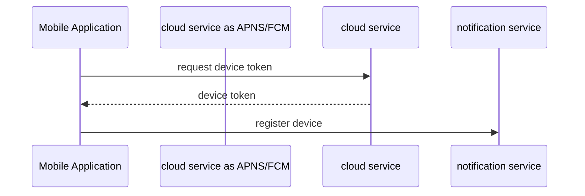
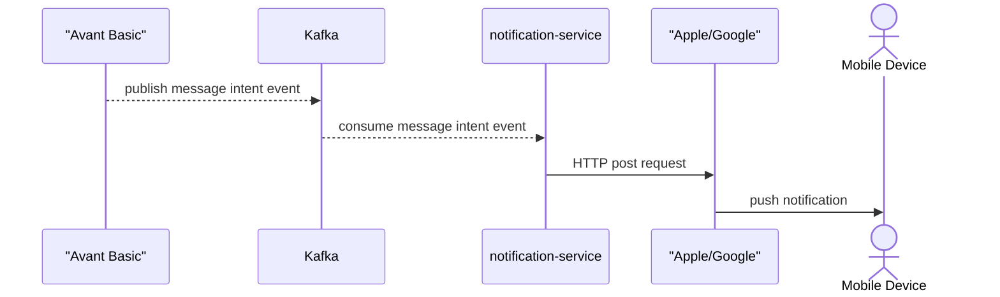
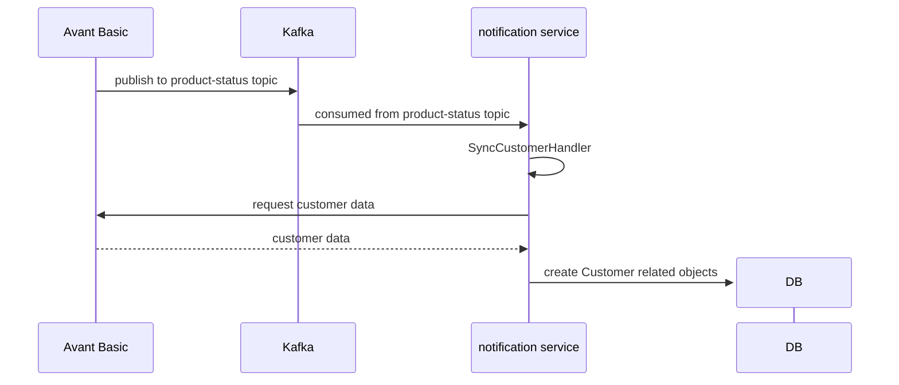
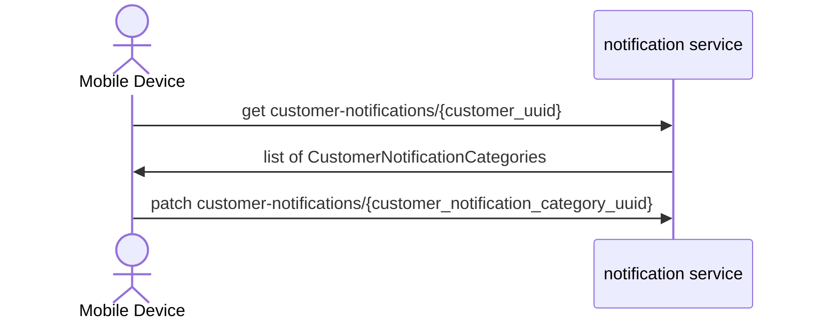
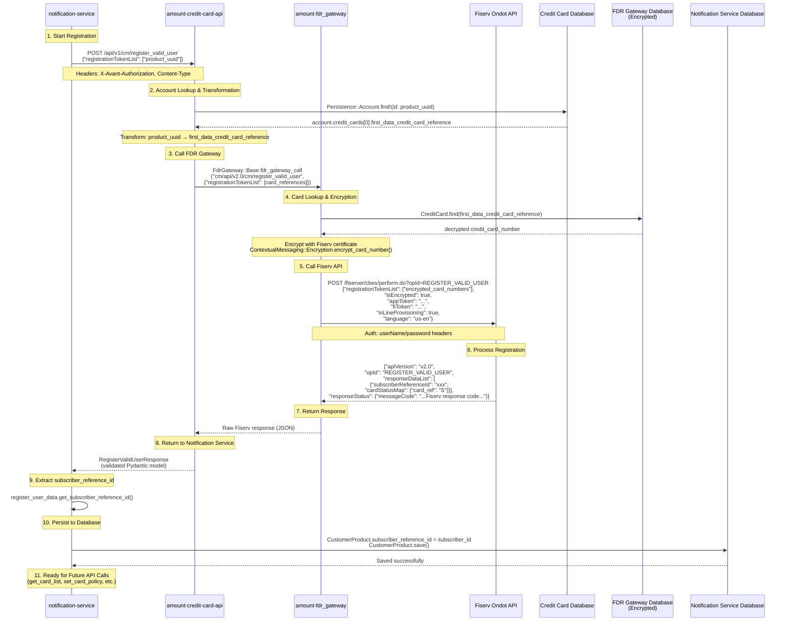

<p align="center">
  
</p>
<p align="center">
    <h1 align="center">NOTIFICATION-SERVICE</h1>
</p>
<p align="center">
    <em>Delivering Speed | Efficiency, Powered by PythonAsgi.</em>
</p>
<p align="center">
	<!-- local repository, no metadata badges. -->
<p>
<p align="center">
		<em>Developed with the software and tools below.</em>
</pe
<p align="center">
	
	
</p>

<br><!-- TABLE OF CONTENTS -->

<details>
  <summary>Table of Contents</summary><br>

- [📍 Overview](#-overview)
- [🧩 Features](#-features)
- [🗂️ Repository Structure](#️-repository-structure)
- [🚀 Getting Started](#-getting-started)
  - [Prerequisites](#prerequisites)
  - [Get Started in 3 Steps](#get-started-in-3-steps)
  - [Common Commands](#common-commands)
  - [⚙️ Installation](#️-installation)
  - [🧪 Testing](#-testing)
    - [🤖 Hooks](#-hooks)
  - [🤖 Usage](#-usage)
- [Bruno (API Management/Testing Tool)](#bruno-api-managementtesting-tool)
  - [Installation](#installation)
  - [Usage](#usage)
- [🤝 Contributing](#-contributing)
- [Deployments](#deployments)
- [Diagrams](#diagrams)
  - [Registering Push Notifications with Apple/Google](#registering-push-notifications-with-applegoogle)
  - [Message Intent](#message-intent)
  - [Importing Customer Related objects](#importing-customer-related-objects)
  - [Customer Updates Notification Preferences](#customer-updates-notification-preferences)
  - [Register Valid User Flow (Fiserv Contextual Messaging API)](#register-valid-user-flow-fiserv-contextual-messaging-api)
- [🔨 Architecture Overview](#-architecture-overview)
  - [Core Django Apps](#core-django-apps)
  - [Key Patterns](#key-patterns)
  - [Authentication](#authentication)
  - [API Structure](#api-structure)
  - [Environment Setup](#environment-setup)
  - [Monitoring](#monitoring)
  - [Data Management Commands](#data-management-commands)
  - [Testing Strategy](#testing-strategy)
  - [Code Quality Standards](#code-quality-standards)
- [🔗 Acknowledgments](#-acknowledgments)
</details>
<hr>

## 📍 Overview

This is a project to handle communication with the clients

---

## 🧩 Features

| Key Technical Capabilities & Characteristics | Details                                                                                                                                                                                                                              |
| -------------------------------------------- | ------------------------------------------------------------------------------------------------------------------------------------------------------------------------------------------------------------------------------------ | ----------------------------------------------------------------------------------------------------------------------------- | ------------- | ------------------------------------------------------------------------------------------------------------------------------------------------------------------------ |
| **💻 ❭ Architecture**                        | This project uses Django and Django-Ninja to build a web interface, backed by Python in a version >= 3.10 environment creating robust web services architecture                                                                      |
| **💯 ❭ CODE QUALITY & STYLE**                | Modern, readably well formatted code structured within Django conventions using PEP-8 with some added specificities for efficient use & testing │                                                                                    |
|  **📝 DOCUMENTATION**                        | The project follows a clear roadmap and relevant sections documented with vital elements provided in the `.md` files (for more details, visit `README`,                                                                              | as needed. For the project's core aspects of design and functionality, these explanations assist developers getting started). |
| **⚡❭ Integrations**                         | Depends on django-ninja for a Ninja based serializers and validation                                                                                                                                                                 | &em SPAN data protection libraries in the near future (e.g. JWT token system for authorization)                               |
|  **Modularity** & **Re-usablitly**           | The `src/base_app` directory groups project fundamentals allowing for flexible development expansion and easier integration within third libraries for scalability (\*e.g., using `ASGI`, `WSGI` protocols). \*\* testing frameworks |
| **Performance**                              | Notable efficiency within Django platform, with additional caching strategies implemented `async`, `multiprocessing` strategies enable quick                                                                                         | resource management. Regular profile insights and monitoring will provide continuous optimization.                            |
| Security                                     | Uses best available data protection such a Django ORM (transactions are encapsulated in objects) but the potential for future integrations ( e.g. JWT token) is essential to enhance authorization and privacy protection            | **\_Dependenc**`es                                                                                                            | \* **python** | Core development relies on python programming capabilities `lock`, `pyproject.toml` used respectively, for handling application locking and project meta-data management |

---

## 🗂️ Repository Structure

```sh
└── notification-service/
    ├── README.md
    ├── pyproject.toml
    ├── src
    │   ├── base_app
    │   └── manage.py
    └── uv.lock
```

---

## 🚀 Getting Started

**System Requirements:**

- **Python**: `version 3.12`
- **Django**: `version 5.1.4`
- **Django Ninja**: `version v1.12.1`
- **uv**: `version 0.5.13`

### Prerequisites

1. **Install Just** (command runner):
   [Just](https://github.com/casey/just) is a command runner that is used to run commands in the project.
   ```bash
   # macOS
   brew install just

   # Linux
   curl --proto '=https' --tlsv1.2 -sSf https://just.systems/install.sh | bash -s -- --to /usr/local/bin

   # Or via cargo
   cargo install just
   ```

2. **Install UV** (Python package manager):
   ```bash
   # macOS/Linux
   curl -LsSf https://astral.sh/uv/install.sh | sh

   # Or via pip
   pip install uv
   ```

3. **Install Docker** (for containerized development):
   - Install [Docker Desktop](https://www.docker.com/products/docker-desktop/)

### Get Started in 3 Steps

```bash
# 1. Start all services (Django, PostgreSQL, Redis, Celery)
just serve

# 2. Install dependencies
just install

# 3. Access the API at http://localhost:8000/api/docs
just docs
```

### Common Commands

```bash
# Development
just serve              # Start services (detached)
just serve true         # Start services (attached, see logs)
just stop               # Stop all services
just logs               # Follow logs

# Code Quality
just lint               # Lint code with ruff
just format             # Format code with ruff
just test               # Run tests
just check-all          # Lint, format, and test

# Database
just migrate            # Run migrations
just makemigrations     # Create migrations

# Django Shell
just console            # Open Django shell_plus
just shell              # Open bash shell
```


### ⚙️ Installation

<h4>From <code>source</code></h4>

> 1. Clone the notification-service repository:
>
> ```console
> $ git clone git@github.com:AvantFinCo/notification-service.git
> ```
>
> 2. Change to the project directory:
>
> ```console
> $ cd notification-service
> ```
>
> 3. Install and Activate virtual environment
>
> ```console
> $ uv sync
> ```
>
> 4. Install the dependencies:
>
> ```console
> $ uv pip install .
> ```
>
> OR for development:
>
> ```console
> $ uv pip install -e .
> ```
>
> The above command will install the package in editable mode, allowing you to make changes to the code and see them reflected immediately without needing to reinstall the package.
> https://docs.astral.sh/uv/concepts/projects/dependencies/#editable-dependencies

### 🧪 Testing

```bash
$ docker-compose exec api uv run pytest src
```

#### 🤖 Hooks

The project come with a couple of hooks to maintain consistency on the code base to install them run the following command

```
$ uv tool install pre-commit --with pre-commit-uv
```

Then run the following command to install the hooks

```
$ pre-commit install
```

Finally if you want to test them run this:

```
$ pre-commit run --all-files
```

### 🤖 Usage

<h4>From <code>source</code></h4>

> Run notification-service using the command below:
>
> ```console
> $ cd src
> $ uv run manage.py runserver
> ```

---

## Bruno (API Management/Testing Tool)

### Installation

`brew install bruno`

### Usage

[Notion Doc for Bruno](https://www.notion.so/avant/API-Management-Tool-Onboarding-1cfd528f956e8038933ad28784ae0861?pvs=4#1d8d528f956e80eba729e4c43570174f)

---

## 🤝 Contributing

Contributions are welcome! Here are several ways you can contribute:

- **[Report Issues](https://avantinc.atlassian.net/jira/software/c/projects/CSRV/boards/993)**: Submit bugs found or log feature requests for the `notification-service` project.
- **[Submit Pull Requests](https://github.com/AvantFinCo/notification-service/blob/main/CONTRIBUTING.md)**: Review open PRs, and submit your own PRs.
- **[Join the Discussions](https://github.com/AvantFinCo/notification-service/discussions)**: Share your insights, provide feedback, or ask questions.

<details closed>
<summary>Contributing Guidelines</summary>

1. **Fork the Repository**: Start by forking the project repository to your local account.
2. **Clone Locally**: Clone the forked repository to your local machine using a git client.
   ```sh
   git clone git@github.com:AvantFinCo/notification-service.git
   ```
3. **Create a New Branch**: Always work on a new branch, giving it a descriptive name.
   ```sh
   git checkout -b new-feature-x
   ```
4. **Make Your Changes**: Develop and test your changes locally.
5. **Commit Your Changes**: Commit with a clear message describing your updates.
   ```sh
   git commit -m 'Implemented new feature x.'
   ```
6. **Push to local**: Push the changes to your forked repository.
   ```sh
   git push origin new-feature-x
   ```
7. **Submit a Pull Request**: Create a PR against the original project repository. Clearly describe the changes and their motivations.
8. **Review**: Once your PR is reviewed and approved, it will be merged into the main branch. Congratulations on your contribution!
</details>

---

## Deployments

Deployment documentation can be found [here in Notion](https://www.notion.so/avant/Notification-Service-17cd528f956e81128d78fd71669d0699#19ed528f956e8060a72bd9fd0d8489a4).

## Diagrams

### Registering Push Notifications with Apple/Google

APNs (Apple Push Notification service) and FCM (Firebase Cloud Messaging) are cloud services provided by Apple for iOS and by Google for Android, respectively. When the mobile application starts the registration sequence is triggered.



### Message Intent



### Importing Customer Related objects

When an application is approved, the status of the application changes.
When the status of the application changes, a message is published to the `prd.default.account-opening.avant-basic.event-publisher.product-status` topic in kafka. The notification service has a kafka consumer, that is listening to the `prd.default.account-opening.avant-basic.event-publisher.product-status` topic, and when it sees a message it takes the customer_uuid and calls [SyncCustomerHandler](https://github.com/AvantFinCo/notification-service/blob/main/src/notification_categories/handlers/sync_customer_handler.py#L26) with the customer_uuid.



### Customer Updates Notification Preferences

You can think of [CustomerNotificationCategories](src/notification_categories/models.py#L123) as a "toggle" that holds two settings.

1. `selected_delivery_method` how a customer should be notified.
2. `enabled` whether or not the customer wants to be notifiied for this type of event.



### Register Valid User Flow (Fiserv Contextual Messaging API)

This diagram shows the complete flow for registering a user with Fiserv's Ondot System API for contextual messaging notifications. The process involves multiple data transformations and encryption steps.



**Key Data Transformations:**

- **Input**: `product_uuid` (also known as `credit_card_account_uuid` in services like Avant Basic)
- **Step 1**: `product_uuid` → `first_data_credit_card_reference` (via database lookup)
- **Step 2**: `first_data_credit_card_reference` → `credit_card_number` (via encrypted database)
- **Step 3**: `credit_card_number` → `encrypted_card_number` (RSA encryption with Fiserv certificate)
- **Output**: `subscriber_reference_id` (used for subsequent Fiserv API calls)

**Database Operations:**

- **Credit Card API**: Queries account and credit card information from Postgres
- **FDR Gateway**: Stores encrypted credit card numbers with `attr_encrypted` gem
- **Response Caching**: Optional Redis caching for account lookups (configurable)

**Security:**

- Credit card numbers encrypted at rest in FDR Gateway database
- Additional RSA encryption with Fiserv's public certificate before API calls
- Shared key authentication between services
- Username/password authentication with Fiserv

**Fiserv Response Status Codes:**

- **cardStatusMap Values**:
  - `S` → Success (card registered successfully)
  - `I` → Card in bad state (card cannot be registered)
  - `R` → Retry request (temporary failure, retry registration)
- **messageCode Values**:
  - `REG_121` → "Subscriber has been successfully created and cards provisioned"
  - `REG_120` → "Subscriber has been successfully created"
  - `REG_122` → "Subscriber found and cards have been merged"
  - `REG_101` → "General failure"
  - (See `RegisterValidUserResponse.MessageCodes` for complete list)

---

## 🔨 Architecture Overview

### Core Django Apps

1. **base_app**: Main application with shared models (`User`, `OutboxEvent`), settings, and infrastructure
2. **notification_categories**: Manages notification types and customer preferences (`NotificationCategory`, `CustomerNotificationCategory`)
3. **notification_content**: Content templates and customer product relationships (`PushTemplate`, `CustomerProduct`)
4. **notification_delivery**: Delivery engine with retry logic (`Push` model)
5. **notification_registration**: Device registration for push notifications
6. **notification_events**: Kafka-based event processing with dead letter queue handling

### Key Patterns

- **Outbox Pattern**: `OutboxEvent` model ensures reliable event publishing to Kafka
- **Event-Driven Architecture**: Kafka consumers process intent events and product status changes
- **Multi-tenancy**: Product-specific notification categories (LOAN, CREDIT, GENERIC)
- **Push Notifications**: Firebase (Android) and APNS (iOS) integration via `django-push-notifications`

### Authentication

- Custom User model uses `customer_uuid` as primary identifier (not username)
- JWT integration for API authentication

### API Structure

- **Django Ninja** framework with automatic OpenAPI documentation
- Separate device endpoints for iOS (APNS) and Android (GCM)
- Customer notification preference management APIs

### Environment Setup

- **Local**: Uses Docker Compose with PostgreSQL, Redis, Kafka, and Zookeeper
- **Dependencies**: Python 3.12+, Django 5.2+, managed via `uv`
- **Background Services**: Celery for async tasks, Kafka for event processing

### Monitoring

- **Datadog**: APM tracing and metrics (configured in settings)
- **Sentry**: Error monitoring and alerting
- **Logging**: Structured JSON logging with python-json-logger

### Data Management Commands

- `generate_payment_reminder_objects`: Creates payment reminder notification objects
- `generate_card_high_purchase_objects`: Creates purchase alert notification objects

### Testing Strategy

- **Location**: Tests in `tests/` subdirectories within each app
- **Coverage**: Configured to exclude migrations and test files
- **Framework**: pytest with Django integration and async support

### Code Quality Standards

- **Linting**: Ruff with automatic fixing
- **Type checking**: mypy with strict configuration
- **Pre-commit**: Enforces trailing whitespace, YAML validation, large file checks, and security scanning with gitleaks

---

## 🔗 Acknowledgments

- List any resources, contributors, inspiration, etc. here.

[**Return**](#-overview)

---
